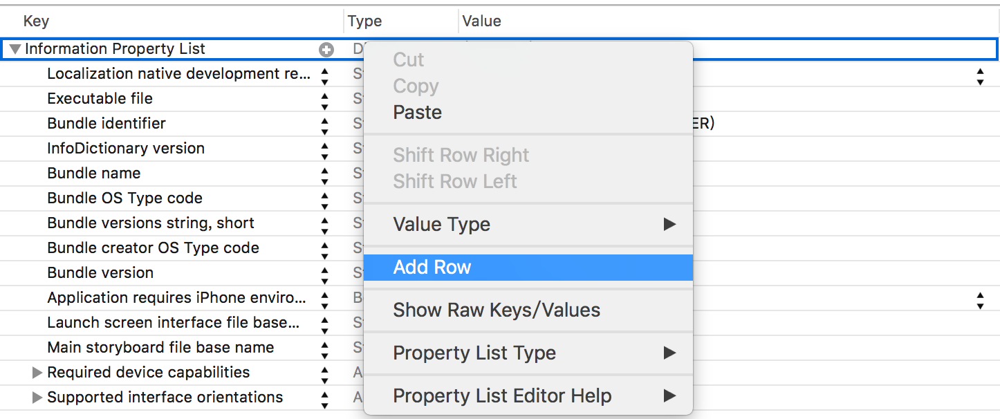
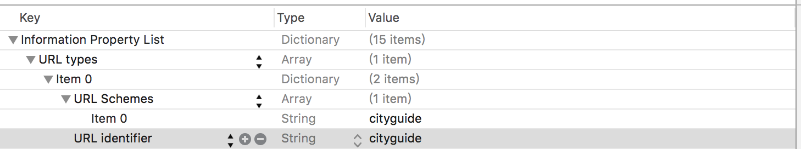
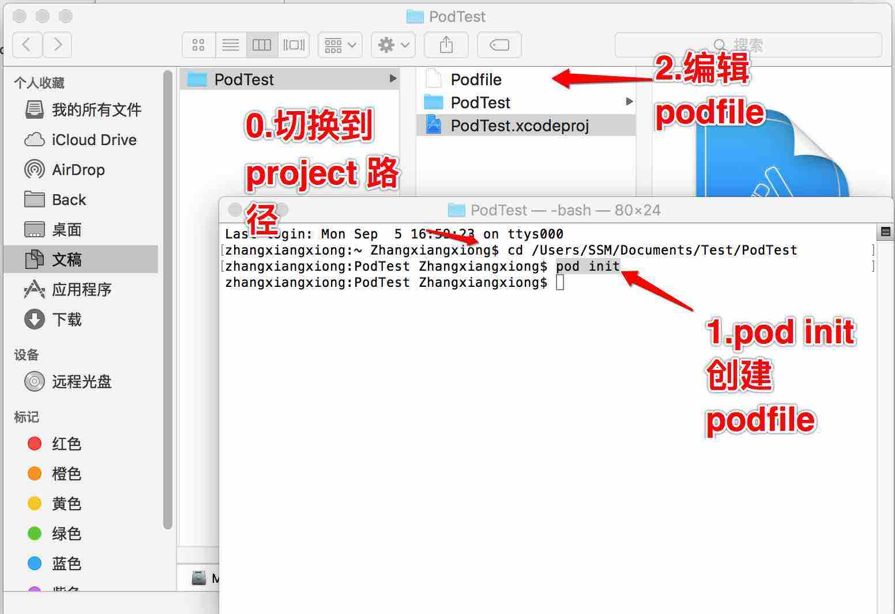

##000_iOS学习笔记

#目录

~~~
2016年09月05日 用户交互响应
2016年09月05日 cocoapods 管理第三方库
2016年09月28日 block的基本使用
~~~

### 2016年09月28日 block的基本使用

~~~objc
#import <Foundation/Foundation.h>

// 注意#define  和 typedef 的使用区别
//#define int(^towNumBlock)(int, int) 写法错误

typedef int(^TowNumBlock)(int, int);

void func(int, int, TowNumBlock, void(^)());

void func(int a , int b, TowNumBlock block, void(^firstLinePrintBlock)())
{
    firstLinePrintBlock();
    printf("%d..\n", block(a,b));
}

int main(int argc, const char * argv[])
{
    
    return 0;
}

/**
 Block 的基本使用。
 首先对“变量”的理解需要更加深刻。
 以前只认为变量是一个"数",比如用 int 定义鸡蛋数目。
 现在变量也可以表示一段代码。把函数也作为变量看。
 
 比如声明【一个处理两个int,并返回一个int】的变量。
 int (^towNumBlock)(int, int);
 
 给之前的变量赋值
 towNumBlock = ^int(int a, int b)
 {
    return a+b;
 };
 
 运行这个“变量”。
 towNumBlock(3,4);
 
 
 另外需要注意函数在声明和定义的不同之处。
 声明的时候,只需要给出变量类型。不需要给变量明。
 
 int sum(int, int);
 
 定义则需要给书变量类型.
 int sum(int a, int b){
  return a+b;
 }
 
 当block作为函数的参数的时候,就需要结合声明和定义给出不同的角度。
 
 typedef int(^TowNumBlock)(int, int);
 
 // 声明
 void func(int, int, TowNumBlock, void(^)());
 
 //定义
 void func(int a , int b, TowNumBlock block, void(^firstLinePrintBlock)())
 {
 firstLinePrintBlock();
 printf("%d..\n", block(a,b));
 }
 */
~~~

***
###2016年09月01日
1.使用代码提示定义*block*,

~~~
// type "inline"
~~~

2: *block* 和 *delegate* 的使用范例:

2.1 场景：

~~~
假设存在*ContractListVC* 和 *ContractAddVC*,当单击*ContractListVC*的**add** 按钮后,页面**push**到*ContractAddVC*。
用户在*ContractAddVC*输入完数据,单击**save** 按钮后,页面**pop**到*ContractListVC*。现在关注点是如何实现数据的逆向传输,即单击了save按钮后,如何触发上一个页面执行代码。
~~~

2.2 使用 *delegate* 的实现机制:

~~~
1：在ContractAddVC 中定义代理，并用之前的代理声明成员对象。
2：在ContractListVC 中声明遵守在第一步中定义的代理。并实现该代理。
3：在ContractListVC跳转前,在找到目标vc实例,并将目标vc的delegate赋值为self。
4：在ContractAddVC中使用delegate 触发代码。
~~~

2.3 使用 *block* 的实现机制:

~~~
//1:在ContractAddVC完成代理的定义和成员变量的声明
// block的定义
typedef void (^ContractAddBlock)(void);

@interface ContactAddViewController : UIViewController

// block成员变量的声明
@property(nonatomic,assign)ContractAddBlock addBlock;

@end

~~~

~~~
//2:在ContractAddVC在合适的使用使用代理,注意防卫型代码,判断block是否为nil

// 当单击保存按钮
- (IBAction)onSaveClick:(id)sender
{
    if(_addBlock != nil)
    {
        _addBlock();
    }
    
    [self.navigationController popViewControllerAnimated:YES];
}

~~~

~~~objc
//2:在ContractListVC完成代理的赋值,实现逆传功能(代码回调)。
// 当单击保存按钮

-(void)prepareForSegue:(UIStoryboardSegue *)segue sender:(id)sender
{
    if([segue.identifier isEqualToString:@"addSegue"])
    {
        ContactAddViewController *destVC = segue.destinationViewController;
        
        //(代码回调)
        destVC.addBlock = ^(void)
        {
            NSLog(@"当ContractAddVC执行了保存操作,此处应该刷新tableview");
        };
    }
}
~~~

###2016年09月03日
####1. 打电话代码
~~~objc

1，这种方法，拨打完*****回不到原来的应用，会停留在通讯录里，而且是直接拨打，不弹出提示
 NSMutableString * str=[[NSMutableString alloc] initWithFormat:@"tel:%@",@"186xxxx6979"];
    //            NSLog(@"str======%@",str);
[[UIApplication sharedApplication] openURL:[NSURL URLWithString:str]];
    
2，这种方法，打完*****后还会回到原来的程序，也会弹出提示，推荐这种
NSMutableString * str=[[NSMutableString alloc] initWithFormat:@"tel:%@",@"186xxxx6979"];
    UIWebView * callWebview = [[UIWebView alloc] init];
    [callWebview loadRequest:[NSURLRequest requestWithURL:[NSURL URLWithString:str]]];
    [self.view addSubview:callWebview];
    [callWebview release];
    [str release];
    
~~~

####2. 振动提示
~~~objc
// first 
@import AudioToolbox;
// second
AudioServicesPlaySystemSound(kSystemSoundID_Vibrate);

~~~

####3. URL Scheme 的作用
在iOS中有系统特定的 URL Scheme。比如打电话的scheme 是 tel:.
打开设置页面的scheme 是"prefs:root=AIRPLANE_MODE"

~~~objc

[[UIApplication sharedApplication] openURL:[NSURL URLWithString:@"prefs:root=AIRPLANE_MODE"]];

~~~

####3.1 如何自定义自己的 sheme？

1. 首先在info.plist 文件中注册 scheme。

1.1

1.2

~~~objc 
// 其他app通过    [[UIApplication sharedApplication] openURL:[NSURL URLWithString:@"cityguide://London"]]; 唤醒
- (BOOL)application:(UIApplication *)application didFinishLaunchingWithOptions:(NSDictionary *)launchOptions {

    // 第三方通过 sheme唤醒 注意检测UIApplicationLaunchOptionsURLKey
    NSLog(@"launchOptions:%@", launchOptions);
    
    if([launchOptions objectForKey:UIApplicationLaunchOptionsURLKey] != nil)
    {
        NSURL* url = launchOptions[UIApplicationLaunchOptionsURLKey];
    }
    return YES;
}

// 如果app在后台运行时,被第三方通过sheme唤醒。 和之前didFinishLaunchingWithOptions 一样处理
-(BOOL)application:(UIApplication *)app openURL:(NSURL *)url options:(NSDictionary<NSString *,id> *)options
{
    return YES;
}

~~~

###2016年09月05日 用户交互响应

###2016年09月05日 cocoapods 管理第三方库

####1.库的分类
1.1 静态库和动态库,静态库是当程序每次运行时都载入到内存中。动态库可以只需载入一次,有需要的程序可以共享该内存的动态库。自定义动态库只能在iOS8以上系统运行。

1.2 库文件的各种格式.

*.a: 纯代码的静态库，没有图片等其他资源。

*.dylib:纯代码动态库。

*.framework:可以包含图片 storyboard等资源的库文件。

2 给project增加 cocoapods支持。

2.1

2.2 查找目标库的版本

$ pod search Masonry >> versions

2.3 编辑 Podfile

pod 'Masonry', '~> 1.0.1'

2.4 安装需要的库,安装完成后,单击workspace 开启project

备注:Masonry的常见宏

~~~
#define MAS_SHORTHAND

#define MAS_SHORTHAND_GLOBALS
~~~
