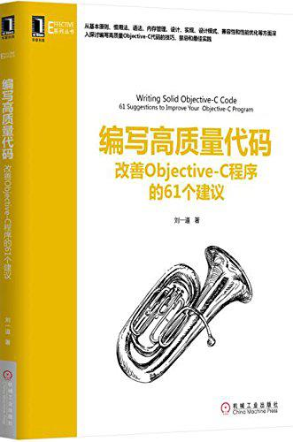

###1. 粗体字大小一般作为Title使用,或章节标题
#一号
##二号
###三号
####四号

###2. 星号的使用
####2.1 三个* 表示分割线
***

####2.2 两个* 括起来标准字体加粗,一般用于正文
**test**

####2.3 一个*括起来,表示斜体
*test*

###3. 引用标识,一般作为章节的前序
>这是引用

###4. 连接
####4.1 文字连接用[...](http:...) 表示文字连接
[某个站点](http://www.51job.com)

####4.2 图片连接,显示网络图片or本地图片,中括号为图片不能显示时的文字说明。

###5.代码块标识
~~~
int main( void )
{
	  // There is some codes here...
	  // 使用 Tab 缩进代码
}
~~~

