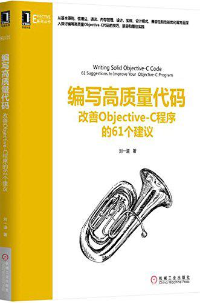

### 1.Objective c 是门动态语言,何为动态语言,

意味着Objective-c代码不能直接编译成机器代码,而是类似于Java一样编译成中间代码,并且需要Runtime将中间代码翻译成机器代码,交给机器执行。


***
objc 的一些代码

```objc
    // some codes
    id obj = self;
    if([obj respondsToSelector:@selector(doSomething:)] )
    {
        
    }
    
    if([obj isKindOfClass:[NSObject class]])
    {
        
    }
    
    [obj doSomething];
```


###1.2动态语言的安全性
动态语言的安全性没有静态语言高,比如java编译成.class后，很容易被反汇编回java代码。所以在安全性要求较高的地方,推荐使用c语言代码。

####1.3 关于在头文件减少#import的使用技巧。
通常会在.h文件使用其它类的支持,(如类成员变量),通常是用*@class someClass*; 来声明存在该类的支持,然后在.m文件中*#import "someClass.h"*。

####1.4 关于常量的定义。
在定义常量的时,除了使用#define 语法,也可以用枚举。

~~~objc

NS_ENUM(NSInteger, EnumTypeName)
{
    enumValue1 = 0,
    enumValue2 = 1,
};


NS_OPTIONS(NSInteger, EnumTypeName)
{
    value1 = 0,
    value2 = 1 <<0,
    value3 = 1 <<1,
};

~~~
	


