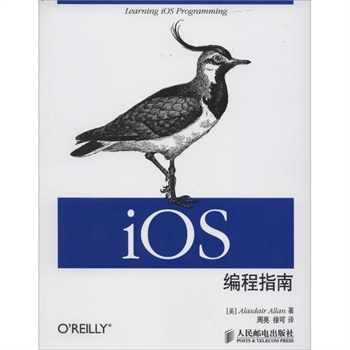

#[iOS编程指南]

> 出版日期 2014年,针对的开发平台是iOS6

###一些常用的快捷键
~~~
cmd+f: 搜索
cmd+g:搜索结果的下一个
cmd+G:搜索结果的上一个
~~~
###第一章
####1.1 本地化应用的优势

&ensp;&ensp;&ensp;&ensp;更能统分使用硬件的性能,比如GPS芯片,加速传感器。

###第二章
>无内容,都是基本的iOS介绍,以及开发证书,真机调试的说明。

###第三章
####3.1 基本概念
Q:什么是事件循环(Runloop)?

A:负责接受外部系统事件,并把事件传递给app处理。

